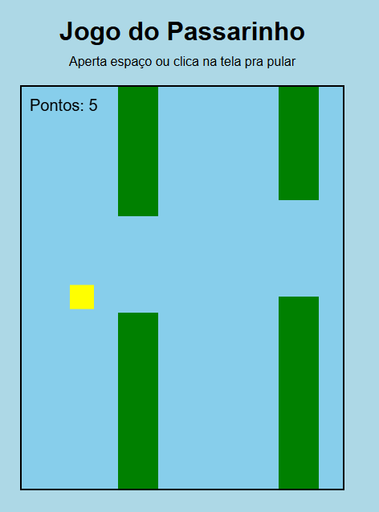

## Preview

# 🐤 Jogo do Passarinho (Flappy Bird simples)

Projeto de um jogo 2D simples inspirado em Flappy Bird, desenvolvido com:

- HTML
- CSS
- JavaScript puro
- Canvas
- 
Acesse o projeto
(https://juskcibem.github.io/jogo-do-passarinho/)

## Como jogar
- Pressione **Espaço** ou clique na tela para pular
- Desvie dos canos
- Pressione **R** para reiniciar

## Conceitos usados
- Loop de jogo (requestAnimationFrame)
- Gravidade e física básica
- Detecção de colisão
- Manipulação de arrays
- Canvas 2D

## Objetivo
Projeto criado para praticar lógica de programação e desenvolvimento de jogos simples no navegador.
